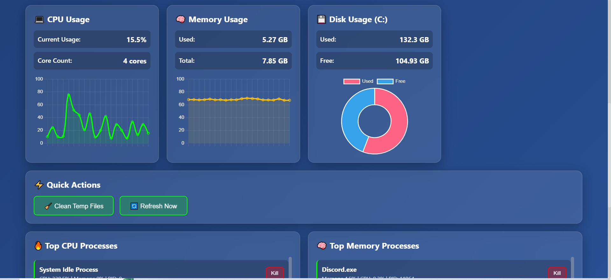
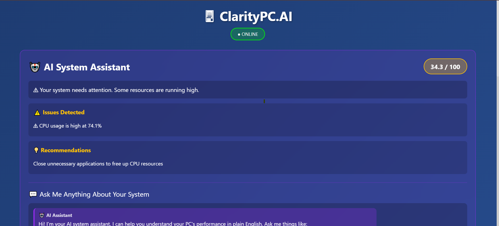
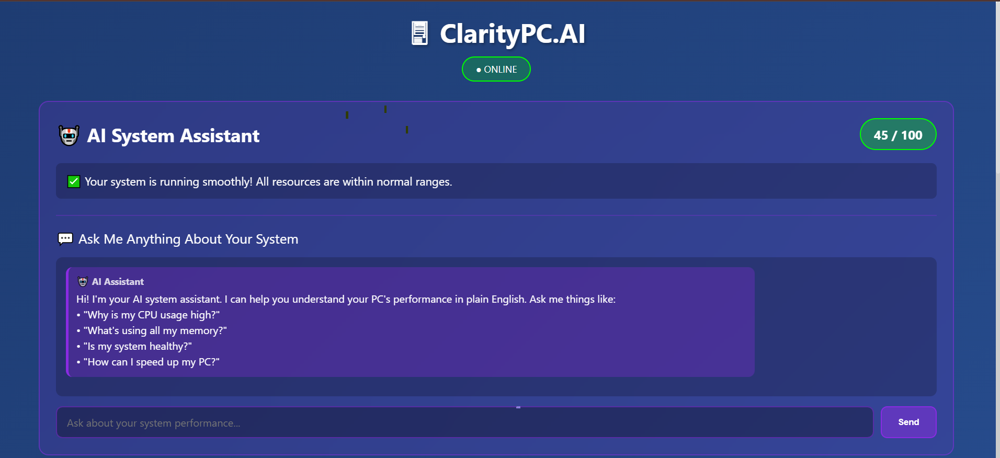
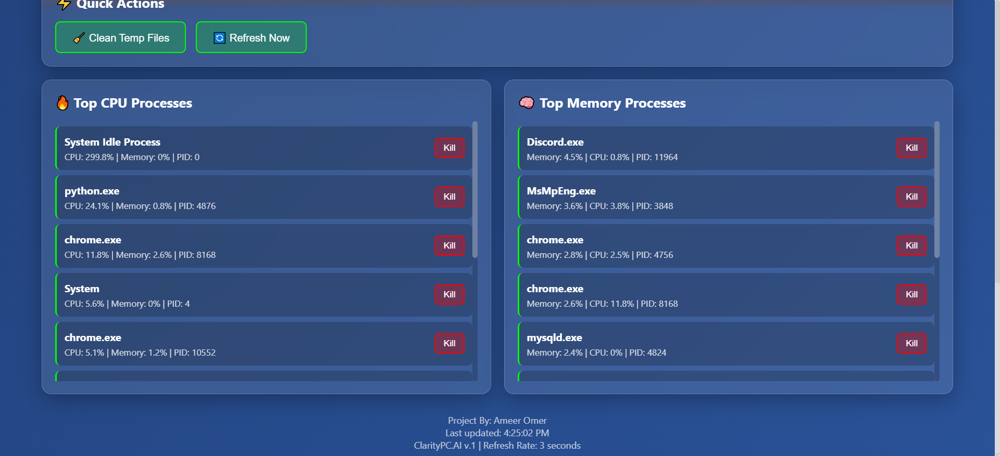

# ClarityPC AI

An AI-powered PC performance dashboard — an internal tool for collecting and visualizing system metrics and operational data in real time. A Flask backend gathers live CPU, memory, disk, and process data with `psutil` and surfaces it on a single-page dashboard with auto-refreshing charts. A built-in assistant, powered by a local LLM (served by [Ollama](https://ollama.com)), interprets the live data and answers questions about system health in plain English. Because the model runs locally, there are no API keys and no per-token costs.

## 📸 Screenshots

| Real-time dashboard | AI system assistant |
| :---: | :---: |
|  |  |
| **AI assistant chat** | **Top processes** |
|  |  |

## 🎬 Interactive Demo

A self-contained, no-install walkthrough of the dashboard is bundled at [`docs/demo.html`](docs/demo.html) — download it and open it in any browser to click through the UI with sample data (no backend or Ollama required).

## 🚀 Features

- **Real-time monitoring**: Live CPU, memory, disk, and process stats with auto-refreshing charts
- **AI system chat**: Ask about your PC in plain English — answers are grounded in your real-time metrics (Llama 3.2 via local Ollama)
- **100% local & private**: The LLM runs on your own machine/server — no cloud, no API keys, no usage fees
- **Automated health analysis**: Rule-based engine flags issues, gives recommendations, and scores overall system health (0–100)
- **Quick actions**: Clean temp files and terminate runaway processes from the dashboard
- **RESTful API**: Clean Flask backend that's easy to integrate or extend

## 🛠️ Technology Stack

- **Backend**: Python, Flask, Flask-CORS
- **AI Integration**: Ollama (local LLM, OpenAI-compatible API) running Llama 3.2
- **Frontend**: HTML, CSS, JavaScript, Chart.js
- **System Monitoring**: psutil

## 📋 Prerequisites

- Python 3.8 or higher
- [Ollama](https://ollama.com) installed, with a model pulled: `ollama pull llama3.2:3b`
- pip (Python package manager)
- **Platform**: Built and tested on Windows (disk stats target the `C:` drive; adjust `app.py` for macOS/Linux)

## 🔧 Installation

1. **Clone the repository**
   ```bash
   git clone https://github.com/YOUR_USERNAME/claritypc_ai.git
   cd claritypc_ai
   ```

2. **Set up virtual environment**
   ```bash
   cd backend
   python -m venv venv
   
   # On Windows:
   venv\Scripts\activate
   
   # On macOS/Linux:
   source venv/bin/activate
   ```

3. **Install dependencies**
   ```bash
   pip install -r requirements.txt
   ```

4. **Configure Ollama (optional)**
   - Copy `.env.example` to `.env` in the `backend` directory
   - Defaults assume Ollama runs locally. To use a remote/self-hosted Ollama, set:
     ```
     OLLAMA_BASE_URL=http://your-server-ip:11434/v1
     OLLAMA_MODEL=llama3.2:3b
     ```
   - (System monitoring works with no config; only the AI chat needs Ollama running.)

## 🚀 Usage

1. **Start the backend server**
   ```bash
   cd backend
   python app.py
   ```
   The server will run on `http://localhost:5000`

2. **Open the frontend**
   - Open `frontend/index.html` in your web browser
   - Or serve it using a local web server:
     ```bash
     # Using Python's built-in server
     cd frontend
     python -m http.server 8000
     ```
     Then navigate to `http://localhost:8000`

3. **Start chatting**
   - Type your PC issue or question in the chat interface
   - Receive AI-powered troubleshooting assistance
   - Follow the step-by-step guidance provided

## 📁 Project Structure

```
claritypc_ai/
├── backend/
│   ├── app.py              # Main Flask application + API endpoints
│   ├── requirements.txt    # Python dependencies
│   ├── .env.example        # Ollama config template (copy to .env)
│   └── venv/               # Virtual environment (not in git)
├── frontend/
│   └── index.html          # Single-page dashboard (Chart.js)
├── .gitignore
└── README.md
```

## 🔒 Security Notes

- The AI runs locally via Ollama — no API keys or secrets to leak
- The `.gitignore` file is configured to exclude your local `.env`
- The `/processes/kill` and `/actions/cleanup` endpoints modify your system — review before exposing the server beyond localhost

## 🎯 Use Cases

- **PC Troubleshooting**: Diagnose and fix common Windows, macOS, or Linux issues
- **Software Installation**: Get guidance on installing and configuring software
- **Performance Optimization**: Receive tips for improving system performance
- **Error Resolution**: Understand and resolve system error messages
- **Hardware Diagnostics**: Get help identifying hardware-related problems

## 📝 Example Queries

- "My computer is running slow, what should I check?"
- "How do I fix a blue screen error in Windows?"
- "My Wi-Fi keeps disconnecting, help me troubleshoot"
- "How do I check if my hard drive is failing?"
- "What's using all my CPU resources?"

## 🤝 Contributing

Contributions are welcome! If you'd like to improve ClarityPC AI:

1. Fork the repository
2. Create a feature branch (`git checkout -b feature/AmazingFeature`)
3. Commit your changes (`git commit -m 'Add some AmazingFeature'`)
4. Push to the branch (`git push origin feature/AmazingFeature`)
5. Open a Pull Request

## 📝 License

This project is open source and available under the MIT License.

## 👤 Author

**Ameer Omer**
- GitHub: [@ameeromer202-IT](https://github.com/ameeromer202-IT)

## 🙏 Acknowledgments

- Ollama for making local LLMs easy to run
- Meta for the Llama 3.2 model
- Flask and psutil for the backend infrastructure
- Chart.js for the dashboard visualizations

## 📧 Support

If you have any questions or run into issues, please open an issue on GitHub or contact me directly.

---

**Note**: The AI chat runs entirely on your own hardware via Ollama — no cloud API, no keys, no per-token costs. Performance depends on your machine and the model size you choose.
